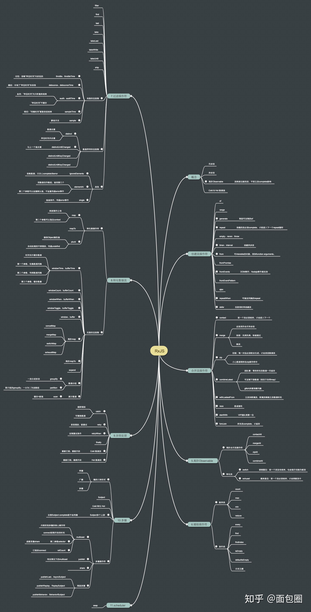

<!--
 * @Author: tangdaoyong
 * @Date: 2021-06-07 17:45:23
 * @LastEditors: tangdaoyong
 * @LastEditTime: 2021-06-09 15:11:16
 * @Description: Observable
-->
# Observable

[重要 Observable 多播和单播](https://zhuanlan.zhihu.com/p/33225623)
[RxJS核心解析——Observable](https://zhuanlan.zhihu.com/p/38133091)

## 介绍



绝大部分工程其实就是对`数据`和`视图`的处理。目前处理数据的方法可以分为`拉取`和`推送`两种，与其对应的数据处理对象即为`消费者`和`生产者`。

* `拉取`很简单，就是一种消费者主动索取所需数据的方式，生产者只有当消费者发出需求信号时才会提供数据。函数调用就是一种简单的拉取实例。
* `推送`则是由生产者决定何时向消费者传送数据，消费者无法自己单独决定获取数据的时机。`JS中的事件监听`和`Promise`就是很典型的数据推送系统。

`RxJS`就是一种更为`强大的数据推送系统`，在其机制下，`Observable`（可观察对象）就是数据的生产者，可以更形象的理解为`Stream`（数据流），在数据流动的过程中可以通过多种映射操作符的处理，由`Observer`（观察者）通过（`Subscribe`）订阅的方式被动接受各种形式的数据。以下为几类常见的拉取和推送模型：

* `Function`: `单次拉取模型`，调用时会`同步`的返回单一值。
* `Generator`: `多次拉取模型`，调用时会`同步`的返回0到无限多个值。
* `Promise`: `单次推送模型`，由生产者决定时机返回单一值。
* `Observable`: `多次推送模型`，由生产者决定时机返回0到无限多个值。

### 多播的心智模型

`多播`是一个术语，它用来描述由单个 `observable` 发出的每个通知会被`多个观察者`所接收的情况。一个 `observable` 是否具备多播的能力取决于它是`热`的还是`冷`的。

`热`的和`冷`的 `observable` 的特征在于 `observable` 通知的生产者是在哪创建的。在 Ben Lesh 的 [热的 Vs 冷的 Observables]() 一文中，他详细讨论了两者间的差异，这些差异可以归纳如下:

* 如果通知的`生产者`是`观察者`订阅 `observable` 时创建的，那么 `observable` 就是`冷`的。例如，`timer observable` 就是冷的，每次订阅时都会创建一个新的定时器。
* 如果通知的`生产者`不是每次观察者订阅 `observable` 时创建的，那么 `observable` 就是`热`的。例如，使用 `fromEvent` 创建的 `observable` 就是`热`的，产生事件的元素存在于 `DOM` 之中，它不是观察者订阅时所创建的。

`冷`的 `observables` 是`单播`的，每个观察者所接收到的通知都是来自`不同的生产者`，生产者是观察者订阅时所创建的。
`热`的 `observables` 是`多播`的，每个观察者所接收到的通知都是来自`同一个生产者`。

有些时候，需要`冷`的 `observable` 具有多播的行为，`RxJS` 引入了 `Subject` 类使之成为可能。

`Subject` 即是 `observable`，又是 `observer` (观察者)。通过使用观察者来订阅 `subject`，然后 `subject` 再订阅`冷的 observable`，可以让`冷`的 `observable` 变成`热`的。这是 `RxJS` 引入 `subjects` 的主要用途，在 Ben Lesh 的 关于 RxJS 中的 Subject 一文中，他指出:**多播是 RxJS 中 Subjects 的主要用法。**

我们来看下面的示例:

import { Observable } from "rxjs/Observable";
import { Subject } from "rxjs/Subject";
import "rxjs/add/observable/defer";
import "rxjs/add/observable/of";

const source = Observable.defer(() => Observable.of(
  Math.floor(Math.random() * 100)
));

function observer(name: string) {
  return {
    next: (value: number) => console.log(`observer ${name}: ${value}`),
    complete: () => console.log(`observer ${name}: complete`)
  };
}

const subject = new Subject<number>();
subject.subscribe(observer("a"));
subject.subscribe(observer("b"));
source.subscribe(subject);
示例中的 source 是冷的。每次观察者订阅 source 时，传给 defer 的工厂函数会创建一个发出随机数后完成的 observable 。

要让 source 变成多播的，需要观察者订阅 subject，然后 subject 再订阅 source 。source 只会看到一个订阅 ( subscription )，它也只生成一个包含随机数的 next 通知和一个 complete 通知。Subject 会将这些通知发送给它的观察者，输出如下所示:

observer a: 42
observer b: 42
observer a: complete
observer b: complete
此示例可以作为 RxJS 多播的基本心智模型: 一个源 observable，一个订阅源 observable 的 subject 和多个订阅 subject 的观察者。

## multicast 操作符和 ConnectableObservable

`RxJS` 引入了 `multicast` 操作符，它可以应用于 `observable` ，使其变成`热`的。此操作符封装了 `subject` 用于多播 `observable` 时所涉及的基础结构。
在看 `multicast` 操作符之前，我们使用一个简单实现的 `multicast` 函数来替代上面示例中的 `subject` :

function multicast<T>(source: Observable<T>) {
  const subject = new Subject<T>();
  source.subscribe(subject);
  return subject;
}

const m = multicast(source);
m.subscribe(observer("a"));
m.subscribe(observer("b"));
代码改变后，示例的输出如下:

observer a: complete
observer b: complete
这并不是我们想要的结果。在函数内部订阅 subject 使得 subject 在被观察者订阅之前就已经收到了 next 和 complete 通知，所以观察者只能收到 complete 通知。

这是可避免的，任何连接多播基础结构的函数的调用者需要能够在 `subject` 订阅源 `observable` 时进行控制。`RxJS` 的 `multicast` 操作符通过返回一个特殊的 `observable` 类型 `ConnectableObservable` 来实现的。

`ConnectableObservable` 封装了多播的基础结构，但它不会立即订阅源 `observable` ，只有当它的 `connect` 方法调用时，它才会订阅源 `observable` 。

我们来使用 multicast 操作符:

import { Observable } from "rxjs/Observable";
import { Subject } from "rxjs/Subject";
import "rxjs/add/observable/defer";
import "rxjs/add/observable/of";
import "rxjs/add/operator/multicast";

const source = Observable.defer(() => Observable.of(
  Math.floor(Math.random() * 100)
));

function observer(name: string) {
  return {
    next: (value: number) => console.log(`observer ${name}: ${value}`),
    complete: () => console.log(`observer ${name}: complete`)
  };
}

const m = source.multicast(new Subject<number>());
m.subscribe(observer("a"));
m.subscribe(observer("b"));
m.connect();
代码改变后，现在观察者可以收到 next 通知了:

observer a: 54
observer b: 54
observer a: complete
observer b: complete
调用 `connect` 时，传入 `multicast` 操作符的 `subject` 会订阅源 `observable`，而 `subject` 的观察者会收到多播通知，这正符合 `RxJS` 多播的基本心智模型。

`ConnectableObservable` 还有另外一个方法 `refCount`，它可以用来确定源 `observable` 何时产生了订阅。

`refCount` 看上去就像是操作符，也就是说，它是在 `observable` 上调用的方法并且返回另一个 `observable`，但是它只是 `ConnectableObservable` 的方法而且不需要导入。顾名思义，`refCount` 返回 `observable`， 它负责维护已产生的订阅的引用计数。

当`观察者``订阅`负责引用计数的 `observable` 时，引用计数会增加，如果前一个引用计数为`0`的话，负责多播基础结构的 `subject` 会订阅源 `observable` 。当观察者取消订阅时，引用计数会减少，如果引用计数归零的话，`subject` 会取消对源 `observable` 的订阅。

我们来使用 refCount :

const m = source.multicast(new Subject<number>()).refCount();
m.subscribe(observer("a"));
m.subscribe(observer("b"));
代码改变后，输出如下所示:

observer a: 42
observer a: complete
observer b: complete
只有第一个观察者收到了 next 通知。我们来看看原因。

示例中的源 `observable` 会立即发出通知。也就是说，一旦订阅了，源 `observable` 就会发出 `next` 和 `complete` 通知，`complete` 通知导致在第二个观察者订阅之前第一个就取消了订阅。当第一个取消订阅时，引用计数会归零，所以负责多播基础结构的 `subject` 也会取消源 `observable` 的订阅。

当第二个观察者订阅时，`subject` 会再次订阅源 `observable`，但由于 `subject` 已经收到了 `complete` 通知，所以它无法被重用。

向 `multicast` 传入 `subject` 的工厂函数可以解决此问题:

const m = source.multicast(() => new Subject<number>()).refCount();
m.subscribe(observer("a"));
m.subscribe(observer("b"));
代码改变后，每次源 observable 被订阅时，都会创建一个新的 subject，输出如下所示:

observer a: 42
observer a: complete
observer b: 54
observer b: complete
因为源 observable 会立即发出通知，所以观察者收到的通知是分开的。将 source 进行修改，以便延迟通知:

import { Observable } from "rxjs/Observable";
import { Subject } from "rxjs/Subject";
import "rxjs/add/observable/defer";
import "rxjs/add/observable/of";
import "rxjs/add/operator/delay";
import "rxjs/add/operator/multicast";

const source = Observable.defer(() => Observable.of(
  Math.floor(Math.random() * 100)
)).delay(0);
观察者依然会收到多播通知，输出如下所示:

observer a: 42
observer b: 42
observer a: complete
observer b: complete

总结一下，上述示例展示了 `multicast` 操作符的以下特点:

* 封装了`多播`的基础结构以符合多播的心智模型；
* 提供了 `connect` 方法以用于确定源 `observable` 何时产生了订阅；
* 供了 `refCount` 方法以用于自动管理源 `observable` 的订阅；
* 如果使用 `refCount`，必须传入 `Subject` 的工厂函数，而不是 `Subject` 实例

接下来我们来看 `publish` 和 `share` 操作符，以及 `publish` 的变种，看看它们是如何在 `multicast` 操作符所提供的基础之上建立的。

### publish 操作符
我们通过下面的示例来看看 publish 操作符:

import { Observable } from "rxjs/Observable";
import "rxjs/add/observable/defer";
import "rxjs/add/observable/of";
import "rxjs/add/operator/delay";
import "rxjs/add/operator/publish";

function random() {
  return Math.floor(Math.random() * 100);
}

const source = Observable.concat(
  Observable.defer(() => Observable.of(random())),
  Observable.defer(() => Observable.of(random())).delay(1)
);

function observer(name: string) {
  return {
    next: (value: number) => console.log(`observer ${name}: ${value}`),
    complete: () => console.log(`observer ${name}: complete`)
  };
}

const p = source.publish();
p.subscribe(observer("a"));
p.connect();
p.subscribe(observer("b"));
setTimeout(() => p.subscribe(observer("c")), 10);
示例中的源 observable 会立即发出一个随机数，经过短暂的延迟后发出另一个随机数，然后完成。这个示例可以让我们看到订阅者在 connect 调用前、connect 调用后以及调用过 publish 的 observable 完成后订阅分别会发生什么。

**publish 操作符是对 multicast 操作符进行了一层薄薄的封装。它会调用 multicast 并传入 Subject 。**

示例的输出如下所示:

observer a: 42
observer a: 54
observer b: 54
observer a: complete
observer b: complete
observer c: complete
观察者收到的通知可归纳如下:

a 是在 connect 调用前订阅的，所以它能收到两个 next 通知和 complete 通知。
b 是在 connect 调用后订阅的，此时第一个立即发送的 next 通知已经发出过了，所以它只能收到第二个 next 通知和 complete 通知。
c 是在源 observable 完成后订阅的，所以它只能收到 complete 通知。
使用 refCount 来代替 connect:

const p = source.publish().refCount();
p.subscribe(observer("a"));
p.subscribe(observer("b"));
setTimeout(() => p.subscribe(observer("c")), 10);
示例的输出如下所示:

observer a: 42
observer a: 54
observer b: 54
observer a: complete
observer b: complete
observer c: complete
输出跟使用 connect 时的类似。这是为什么？

b 没有收到第一个 next 通知是因为源 observable 的第一个 next 通知是立即发出的，所以只有 a 能收到。

c 是在调用过 publish 的 observable 完成后订阅的，所以订阅的引用计数已经是0，此时将会再生成一个订阅。但是，`publish` 传给 `multicast` 的是 `subject`，而不是`工厂函数`，因为 `subjects` 无法被复用，所以 c 只能收到 complete 通知。

publish 和 multicast 操作符都接受一个可选的 selector 函数，如果指定了此函数，操作符的行为将会有很大的不同。这将在另一篇文章 multicast 操作符的秘密中详细介绍。

### 特殊类型的 subjects

publish 操作符有几个变种，它们都以一种类似的方式对 multicast 进行了包装，传入的是 subjects，而不是工厂函数。但是，它们传入的是不同类型的 subjects 。

publish 变种使用的特殊类型的 subjects 包括:

* BehaviorSubject
* ReplaySubject
* AsyncSubject
关于如何使用这些特殊类型的 subjects 的答案是: 每个变种都与一个特殊类型的 subject 相关联，当你需要的行为类似于某个 publish 变种时，就使用相对应的 subject 。我们来看看这些变种的行为是怎样的。

### publishBehavior 操作符
publishBehavior 传给 multicast 的是 BehaviorSubject，而不是 Subject 。BehaviorSubject 类似于 Subject，但如果 subject 的订阅发生在源 observable 发出 next 通知之前，那么 subject 会发出包含初始值的 next 通知。

我们更改下示例，给生成随机数的源 observable 加上短暂的延迟，这样它就不会立即发出随机数:

const delayed = Observable.timer(1).switchMapTo(source);
const p = delayed.publishBehavior(-1);
p.subscribe(observer("a"));
p.connect();
p.subscribe(observer("b"));
setTimeout(() => p.subscribe(observer("c")), 10);
示例的输出如下所示:

observer a: -1
observer b: -1
observer a: 42
observer b: 42
observer a: 54
observer b: 54
observer a: complete
observer b: complete
observer c: complete
观察者收到的通知可归纳如下:

a 是在 connect 调用前订阅的，所以它能收到带有 subject 的初始值的 next 通知、源 observable 的两个 next 通知和 complete 通知。
b 是在 connect 调用后但在 subject 收到源 observable 的第一个 next 通知前订阅的，所以它能收到带有 subject 的初始值的 next 通知、源 observable 的两个 next 通知和 complete 通知。
c 是在源 observable 完成后订阅的，所以它只能收到 complete 通知。
### publishReplay 操作符
publishReplay 传给 multicast 的是 ReplaySubject，而不是 Subject 。顾名思义，每当观察者订阅时，ReplaySubject 会重放指定数量的 next 通知。

const p = source.publishReplay(1);
p.subscribe(observer("a"));
p.connect();
p.subscribe(observer("b"));
setTimeout(() => p.subscribe(observer("c")), 10);
使用了 publishReplay，示例的输出如下所示:

observer a: 42
observer b: 42
observer a: 54
observer b: 54
observer a: complete
observer b: complete
observer c: 54
observer c: complete
观察者收到的通知可归纳如下:

a 是在 connect 调用前订阅的，此时 subject 还没有收到 next 通知，所以 a 能收到源 observable 的两个 next 通知和 complete 通知。
b 是在 connect 调用后订阅的，此时 subject 已经收到了源 observable 的第一个 next 通知，所以 b 能收到重放的 next 通知、源 observable 的第二个 next 通知和 complete 通知。
c 是在源 observable 完成后订阅的，所以它能收到重放的 next 通知和 complete 通知。
来看看 c 的行为，很明显，不同于 publish 操作符，publishReplay 操作符适合使用 refCount 方法，因为观察者在源 observable 完成后订阅依然能收到任意数量的重放的 next 通知。

### publishLast 操作符
publishLast 传给 multicast 的是 AsyncSubject，而不是 Subject 。AsyncSubject 是最特别的特殊类型 subjects 。只有当它完成时，才会发出 next 通知 (如果有 next 通知的话) 和 complete 通知，这个 next 通知是源 observable 中的最后一个 next 通知。

const p = source.publishLast();
p.subscribe(observer("a"));
p.connect();
p.subscribe(observer("b"));
setTimeout(() => p.subscribe(observer("c")), 10);
使用了 publishLast，示例的输出如下所示:

observer a: 54
observer b: 54
observer a: complete
observer b: complete
observer c: 54
observer c: complete
观察者收到的通知可归纳如下:

a 和 b 都是在源 observable 完成前订阅的，但直到源 observable 完成它们才能收到通知，它们能收到带有第二个随机数的 next 通知和 complete 通知。
c 是在源 observable 完成后订阅的，它能收到带有第二个随机数的 next 通知和 complete 通知。
与 publishReplay 类似，publishLast 操作符适合使用 refCount 方法，因为观察者在源 observable 完成后订阅依然能收到任意数量的重放的 next 通知。

### share 操作符

`share` 操作符类似于使用 `publish().refCount()` 。但是，`share` 传给 `multicast` 的是工厂函数，这意味着在引用计数为`0`之后发生订阅的话，会创建一个新的 `Subject` 来订阅源 `observable` 。

const s = source.share();
s.subscribe(observer("a"));
s.subscribe(observer("b"));
setTimeout(() => s.subscribe(observer("c")), 10);
使用了 share，示例的输出如下所示:

observer a: 42
observer a: 54
observer b: 54
observer a: complete
observer b: complete
observer c: 6
observer c: 9
observer c: complete
观察者收到的通知可归纳如下:

a 订阅后立即收到第一个 next 通知，随后是第二个 next 通知和 complete 通知。
b 只能收到第二个 next 通知和 complete 通知。
c 是在源 observable 完成后订阅的，会创建一个新的 subject 来订阅源 observable，它会立即收到第一个 next 通知，随后是第二个 next 通知和 complete 通知。
在上面这些示例中，我们介绍了 publish 和 share 操作符，当源 observable 完成时，a 和 b 会自动取消订阅。如果源 observable 报错，它们也同样会自动取消订阅。publish 和 share 操作符还有另外一个不同点:

* 如果源 `observable` 报错，由 `publish` 返回的 `observable` 的任何将来的订阅者都将收到 `error` 通知。
* 但是，由 `share` 返回的 `observable` 的任何将来的订阅者会生成源 `observable` 的一个新订阅，因为错误会自动取消任何订阅者的订阅，将其引用计数归零。
就这样了，本文到此结束。我们介绍了六个操作符，但它们全是通过一种类似的方式来实现的，它们全都符合同一个基本的心智模型: **一个源 observable、一个订阅源 observable 的 subject 和多个订阅 subject 的观察者。**

本文只是简略地介绍了 refCount 方法。想要深入了解，请参见 [RxJS: 如何使用 refCount](https://zhuanlan.zhihu.com/p/33621290)。

## Observable的冷热信号(Hot vs Cold Observables)

[Hot vs Cold Observables](https://blog.csdn.net/weixin_33904756/article/details/88986032)

* `Cold Observables`在被订阅后运行，也就是说，`observables`序列仅在`subscribe`函数被调用后才会推送数据。与`Hot Observables`不同之处在于，`Hot Observables`在被订阅之前就已经开始产生数据，例如`mouse move`事件。

Hot Observable：热被观察对象，类似于直播，看到的内容是从你打开直播的那一刻开始的，之前的内容已经错过。只能接收订阅那一刻开始的数据。
Cold Observable：冷被观察对象，类似于录播，看到的内容是你打开的视频的第一秒种开始的。每次订阅都会从头开始接收数据。

`Observable`是具有惰性求值的，只有在被订阅的时候才会执行内部逻辑，而`Cold Observable`则更进一步，在没有被订阅的时候，连数据都不会产生。

### Observable冷信号(Cold Observables)

新的订阅者每次从头开始。后订阅的获取的可能是以前的值。
`Observables`在每次订阅后开始产生数据，这使得它成为`冷模式`下的`Observable`。

### Observable热信号(Hot Observables)

所有的`观察者`，无论进来的早还是晚，看到的是同样内容的同样进度，订阅的时候得到的都是最新时刻发送的值。是实时的值。

### 将Cold Observables转化为Hot Observable

```

```
## Observable 生命周期

### 创建 Observable

#### create

使用`new Observable`创建`Observable`。`RxJS 7.0`不再使用`Rx.Observable.create`构建`Observable`。

```ts
import { Observable } from 'rxjs';

// 创建一个可观察对象
const observable = new Observable<number>((subscribe) => {
    // 内部产生的新事件
    subscribe.next(1)
    setTimeout(() => {
        subscribe.next(2)
    })
    subscribe.next(3)
})
// 可观察对象添加监听
observable.subscribe((value) => {
    console.log(`value=${value}`)
})
/*
value=1
value=3
value=2
*/
```
当创建的`可观察对象`被`订阅`时即可执行其中的逻辑流出数据源。

#### 使用创建操作符来创建各种各样的Observable

##### of

of类似于一个迭代器，将参数迭代然后发出。

##### from

将Iterable,Array转化为Observable

##### just

将传入不同类型数据（可复数）转化为发射这些数据的Observable

##### fromEvent

处理`Event`，其他和`of`,`from`一样

```ts
const source = fromEvent(document.body, 'click');
```

##### fromPromise

处理`Promise`，其他和`of`,`from`一样

##### repeat

创建一个`重复`发射`指定数据`或`数据序列`的Observable

##### repeatWhen

和repeat相同，但是发射依赖另一个Observable的终止通知

##### defer

延迟创建型Observable，只有当被订阅时才为每个订阅创建一个新的Observable

##### range

创建一个发射指定范围内整数序列的Observable

##### interval

创建一个按照给定时间间隔发射无限递增整数序列的Observable

##### never

创建一个不发射任何数据的Observable

##### empty

创建一个立刻完成的Observable

##### error

创建一个立刻错误的Observable

##### throw

throw，它也只做一件事就是拋出错误。

##### timer

创建一个在给定延时之后发射`单个数据`的Observable
timer有两个参数
* 第一个参数表示到发送第一个值的间隔时间
* 第二个参数表示从发送第二个参数开始，每发送一个值的间隔时间，如果第二个参数为空则发送第一个参数后，终止，执行complete函数。

### 订阅 Observable

使用`subscribe`订阅创建的`Observable`

```ts
import { Observable } from 'rxjs';

// 创建一个可观察对象
const observable = new Observable<number>((subscribe) => {
    // 内部产生的新事件
    subscribe.next(1)
    setTimeout(() => {
        subscribe.next(2)
    })
    subscribe.next(3)
})
// 可观察对象添加监听
observable.subscribe((value) => {
    console.log(`value=${value}`)
})
/*
value=1
value=3
value=2
*/
```
`订阅方法名`和`创建数据流时的订阅函数名`相同，我们可以将订阅方法的调用看作是对该订阅函数的唤起，此时内部的逻辑就准备执行了。如果对数据流多次订阅，订阅函数每次执行都是相互独立的。

**注意**`subscribe订阅`它是`同步`进行的。但其中的数据流逻辑可以决定数据是`同步`还是`异步`的流出。

### 执行 Observable

数据流创建后不会立刻开始流动，只有在被订阅之后数据流才会在特定时间段里同步或异步的产生特定数据，数据流动的逻辑在订阅函数中进行描述。

数据流可以推送三种类型的值：

* Next: 实际产生所需的数据，包括各种数据类型
* Error: 流动异常时抛出错误
* Complete：数据流传输完成

### 取消订阅

创建`Observable`时，可以返回一个函数，这个函数会在`Subscription`调用`unsubscribe`时调用，从而取消的相关处理。

如下是`冷源``Observable`取消订阅相关测试。

```ts
/**
 * 取消订阅函数
 */
const observableOne$ = new Observable<number>((observer) => {
    console.log('setInterval')
    let number = 0
    let id = setInterval(() => {
        observer.next(number++)
    }, 1000)
    return () => {
        console.log('clearInterval')
        clearInterval(id)
    }
})

let subscriptionOne  = observableOne$.subscribe({
    next: (value: number) => {
        console.log(`observer1${value}`)
    },
    error: (err: any) => {
        console.log(`observer1${err}`)
    },
    complete: () => {
        console.log('完成1')
    }
})

setTimeout(() => {
    subscriptionOne.unsubscribe()
}, 5000);

// 创建 观察者 实现 Observer 接口
class observer implements Observer<number> {
    next = (value: number) => {
        console.log(`observer2${value}`)
    }
    error = (err: any) => {
        console.log(`observer2${err}`)
    }
    complete = () => {
        console.log('完成2')
    }
}
let subscriptionTwo = observableOne$.subscribe(new observer)
setTimeout(() => {
    subscriptionTwo.unsubscribe()
}, 5000);
```