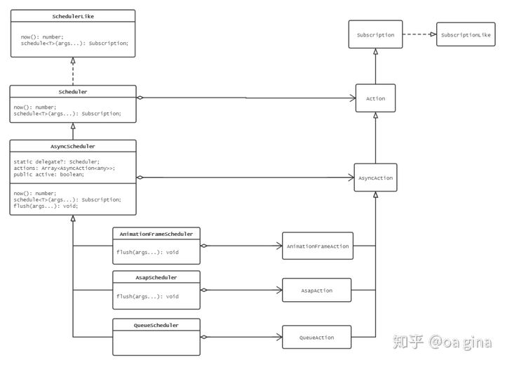

<!--
 * @Author: tangdaoyong
 * @Date: 2021-06-07 21:39:41
 * @LastEditors: tangdaoyong
 * @LastEditTime: 2021-06-09 11:48:17
 * @Description: Schedulers
-->
# Schedulers

[Schedulers 调度](https://zhuanlan.zhihu.com/p/30116132)

## 介绍

`RxJS` 的存在是为了处理异步 `IO`，而异步 `IO` 所包含的一系列 `API` 肯定也是要经过进一步的封装才能让 `RxJS` 中的异步操作使用。



根据 JS 的所能够提供的异步能力来设计这些基本结构。

* AsyncScheduler：异步调度器，使用 setInterval 实现。
* QueueScheduler：队列异步调度器，继承了 AsyncScheduler，但是 QueueAction 是一种链式结构，使得调度以迭代器的形式进行。
* AnimationFrameScheduler：使用 reqeustAnimationFrame 实现了帧调度器。
* AsapScheduler：使用 Promise.resolve().then() 实现的微任务调度器。

`RxJS` 使用所谓的**递归调度器**。

## 调度器

`RxJS` 使用所谓的**递归调度器**。可以通过使用不同的调度器来改变事件发出的顺序及速度。

### 递归调度器

```ts
import { of } from 'rxjs'
import { combineLatestWith, map } from 'rxjs/operators'

/**
 * 递归调度器
 */

const a$ = of(1, 2)
const b$ = of(3)

const c$ = a$.pipe(
    combineLatestWith(b$),
    map(([value1, value2]) => {
        return value1 + value2
    })
)

c$.subscribe((value) => {
    console.log(`递归调度器${value}`)
})
// 递归调度器5
```
由于`RxJS` 使用**递归调度器**。所以上面的信号产生流程如下：

* `c$` 被订阅
* 输入流 `a$` 被订阅
* `a$` 发出值 1
* `combineLatestWith` 将 1 作为 `a$` 的最新值进行保存
* `a$` 发出值 2
* `combineLatestWith` 将 2 作为 `a$` 的最新值进行保存
* 输入流 `b$` 被订阅
* `b$` 发出值 3
* `combineLatestWith` 将 3 作为 `b$` 的最新值进行保存
* `combineLatestWith` 现在同时拥有了 `a$` 和 `b$` 的值，因此它发出值 2 + 3，值为5的信号。

可以看出**递归调度器**同步执行完一个`Observable`才执行下一个。

### asapScheduler

AsapScheduler：使用 Promise.resolve().then() 实现的微任务调度器。
`asap 调度器`使用 `setImmediate` 来安排任务尽快运行，但`不是同步`的。

```ts
/**
 * asap 调度器
 */

const d$ = scheduled(from([1, 2]), asapScheduler)
const e$ = of(3)

const f$ = d$.pipe(
    combineLatestWith(e$),
    map(([value1, value2]) => {
        return value1 + value2
    })
)

f$.subscribe((value) => {
    console.log(`asap 调度器${value}`)
})
// asap 调度器4
// asap 调度器5
```

上面的信号产生流程如下：

* `c$` 被订阅
* 输入流 `a$` 被订阅
* 输入流 `b$` 被订阅
* `a$` 发出值 1
* `combineLatestWith` 将 1 作为 `a$` 的最新值进行保存
* `b$` 发出值 3
* `combineLatestWith` 将 3 作为 `b$` 的最新值进行保存
* `combineLatestWith` 现在同时拥有了 `a$` 和 `b$` 的值，因此它发出值 1 + 3，值为4的信号。
* `a$` 发出值 2
* `combineLatestWith` 将 2 作为 `a$` 的最新值进行保存
* `combineLatestWith` 现在同时拥有了 `a$` 和 `b$` 的值，因此它发出值 2 + 3，值为5的信号。

其中**a$ 发出值 1**和**b$ 发出值 3**的顺序不确定。但不影响输出结果。因为`combineLatestWith`需要都有值的时候才发出信号。

### asyncScheduler

AsyncScheduler：异步调度器，使用 setInterval 实现。

### queueScheduler

QueueScheduler：队列异步调度器，继承了 AsyncScheduler，但是 QueueAction 是一种链式结构，使得调度以迭代器的形式进行。

### animationFrameScheduler

AnimationFrameScheduler：使用 reqeustAnimationFrame 实现了帧调度器。